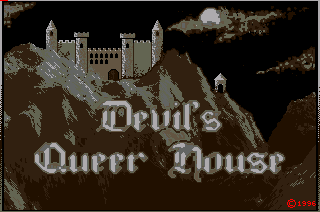

# Devil's Queer House (1994-1996)

## Download
* [Original DQH Game emulated using (E/Win)UAE available for Linux and Windows](https://github.com/vsimko/dqh-amiga/releases)
  * Linux version tested on Ubuntu 10.4 32bit and Linux Mint 17.1 64bit
  * Windows version tested on WinXP 32bit
* [Graphical patterns used in the level design and animations](dqh-patterns.png)

## First prototype
I started programming this platformer game in 1994 using the awfully slow AmigaBasic interpreter.
The first version consisted of a huge animated background image with 2 frames.
In order to achieve 15fps, I had to limit the window-size to some 200x120 pixels and to use the blitter HW support to copy the window content from the off-screen buffer to the visible window. Using a double buffering technique, I was able to smoothly follow the main character as he walked in front of the background image.
However, only one visible monster was supported at a time.

## Version v1.0 for Amiga 500
Later, after I lost half of the project's data due to an invalid floppy, I decided to completely rewrite the code.
I also changed the approach how levels were created. Instead of drawing a complete background image, [I used a single image as an archive of patterns](dqh-patterns.png). Using the level editor, the patterns would be mixed to form the level graphics.
Every level consists of 10 screens linked together in an arbitrary way. The engine supports **multiple animated monsters** to be visible simultaneously on a single screen. A screen might also contain **teleports**, **locked doors** and **traps**.
Again, I continued developing the game in AmigaBasic and later, in 1995, switched to [GFA-Basic](Screenshots/web/dqh-gfabasic.png) which significantly improved the speed of development as well as the game.

The Amiga version of Devil's Queer House was finished in 1996 with 7 levels and no final boss.

## Features
* the game contains 14 animated characters + the main character called "Palko"
* contains a level editor (written in AmigaBasic:
  * [GFX-Editor](editor/dqh-editor-gfx.lst)
  * [DATA-Editor](editor/dqh-editor-data.lst)
* 8 colors that together with a dithering technique give a feeling of some 36 colors
* all the graphics was created in '''Deluxe Paint IV'''
* the game runs on 7Mhz Amiga 500 with 1MB of memory (CHIP RAM)

## Level 1 - Gandma's House

## Level 2 - Secret Underground

## Level 3 - Factory

## Level 4 - Mines

## Level 5 - Castle

## Level 6 - Garden

## Level 7 - Robots

## Ending

